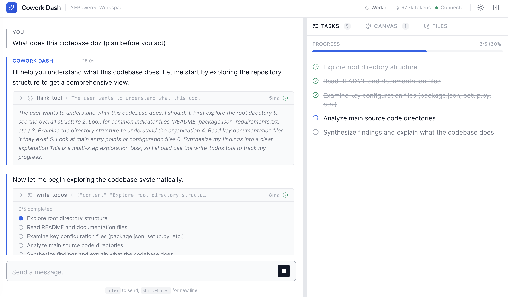

# LangStage

**The web stage for your LangGraph agent.** A chat workspace for [LangGraph](https://github.com/langchain-ai/langgraph) and [deepagents](https://github.com/langchain-ai/deepagents) agents — real-time streaming, a workspace file browser, scheduled runs, and a canvas for visualizations.

> Renamed from **cowork-dash** (the old package name now just installs this one, and the `cowork-dash` command still works).

<p align="center">
  
</p>

**Stack**: Python (FastAPI, chat over Server-Sent Events) backend, React (TypeScript + Vite) frontend.

## Every stage for your LangGraph agent

langstage is the web stage (and namesake) of the **LangStage family**: write your agent once — any LangGraph `CompiledGraph`, from a single ReAct agent to a multi-agent supervisor — and run it on every stage with the same spec string (`module:attr` or `path/to/file.py:attr`), the same `langstage.toml` config file, and the same `LANGSTAGE_*` environment variables.

> **Multi-agent works out of the box.** A supervisor, swarm, or crew compiles to the same `CompiledStateGraph` langstage loads, so its routing and hand-offs stream just like a single agent — no extra setup. See [Running a multi-agent supervisor](https://dkedar7.github.io/langstage-docs/guides/multi-agent-supervisor/).

| Stage | Package | Try it |
|---|---|---|
| Web app | langstage | **you are here** |
| JupyterLab | [langstage-jupyter](https://github.com/dkedar7/langstage-jupyter) | `pip install langstage-jupyter`, then the chat sidebar in `jupyter lab` |
| Terminal | [langstage-cli](https://github.com/dkedar7/langstage-cli) | `langstage-cli -a my_agent.py:graph` |
| VS Code | [langstage-vscode](https://github.com/dkedar7/langstage-vscode) | chat participant + stdio sidecar |
| Reference agent | [langstage-hermes](https://github.com/dkedar7/langstage-hermes) | `LANGSTAGE_AGENT_SPEC=langstage_hermes.agent:graph` on any stage |
| Shared core | [langstage-core](https://github.com/dkedar7/langstage-core) | typed events + config resolver behind every stage |

### Serve over AG-UI

This surface's agent — any LangGraph `CompiledGraph` — can also be served over the [AG-UI protocol](https://github.com/dkedar7/langstage-core) for use with AG-UI compatible clients:

```bash
pip install "langstage-core[agui]"
langstage-agui --agent my_agent.py:graph
```

📖 **Full documentation:** <https://dkedar7.github.io/langstage-docs/>

## Features

- **Chat** with real-time token streaming over Server-Sent Events (`GET /api/stream` + `POST /api/chat`)
- **Tool call visualization** — inline display of arguments, results, duration, and status
- **Rich inline content** — HTML, Plotly charts, images, DataFrames, PDFs, and JSON rendered directly in the chat
- **Canvas panel** — persistent report surface for charts, tables, diagrams, images, and narrative markdown. Opt-in via `CanvasMiddleware`; auto-detected by the UI.
- **File browser** — workspace file tree with syntax-highlighted viewer and live file change detection
- **Plan** — sidebar todo list with progress bar, synced with agent `write_todos` calls (the **Plan** tab)
- **Async task board** — delegate tasks to background copies of the agent and track them on a Kanban board (`queued → ongoing → review → done`); click a task to live-tail its stream, approve/reject human-in-the-loop pauses, and send follow-ups. The agent can also spawn its own async sub-tasks. See [Task board](#task-board).
- **Human-in-the-loop** — interrupt dialog for reviewing and approving agent actions
- **Slash commands** — `/save-workflow`, `/create-workflow`, and `/run-workflow` with autocomplete
- **Print / export** — print conversations via browser Print dialog with optimized CSS
- **Token usage** — cumulative counter with per-turn breakdown chart
- **Authentication** — optional HTTP Basic Auth for all endpoints
- **Theming** — light, dark, and system-auto modes
- **Customization** — title, subtitle, welcome message, agent name, and custom icon

## Installation

```bash
pip install langstage
```

## Quick Start

### No agent or API key yet?

```bash
langstage run --demo
```

launches the full UI against a built-in keyless echo agent, so you can explore the surface before wiring up a real agent.

> **Note:** running `langstage run` with no `--demo` and no `--agent` falls
> back to the built-in default agent, which requires the `deepagents` extra.
> Install it with `pip install "langstage[deepagents]"`, or use `--demo`
> above for a zero-setup path that needs no extra install.

### From Python

```python
from langstage import CoworkApp

app = CoworkApp(
    agent=your_langgraph_agent,  # Any LangGraph CompiledGraph
    workspace="./workspace",
    title="My Agent",
)
app.run()
```

### From CLI

```bash
# Point to a Python file exporting a LangGraph agent
langstage run --agent my_agent.py:agent --workspace ./workspace

# With options
langstage run --agent my_agent.py:agent --port 8080 --theme dark --title "My Agent"
```

### Shorthand

```python
from langstage import run_app

run_app(agent=your_agent, workspace="./workspace")
```

### Enabling the Canvas

The canvas is opt-in. Attach `CanvasMiddleware` to your agent and the Canvas tab appears in the UI automatically:

```python
from deepagents import create_deep_agent
from langstage import CoworkApp
from langstage.middleware import CanvasMiddleware

agent = create_deep_agent(
    tools=[...],
    middleware=[CanvasMiddleware()],   # <-- adds canvas tools + report guidance
    ...
)

CoworkApp(agent=agent, workspace="./workspace").run()
```

The middleware injects five tools (`add_to_canvas`, `update_canvas_item`, `remove_canvas_item`, `add_canvas_section`, `reorder_canvas`) and appends report-building instructions to the system prompt at each model call. Canvas items persist to `.canvas/canvas.md` in the workspace.

To force the tabs on/off regardless of middleware: `--show-canvas/--no-show-canvas`, `--show-files/--no-show-files`, or the Python-API `show_canvas` / `show_files` kwargs.

## Bring your own agent

Point `--agent` at any compiled LangGraph graph — `langstage run --agent my_agent.py:graph`. Most of the UI works immediately; a few features light up when your agent follows a convention or carries a tool.

**Works out of the box (no agent changes):** chat with token streaming, tool-call visualization, the file browser, the **task board** (delegate any agent from the UI), and **schedules**.

**Auto-handled:** if your graph has no checkpointer, LangStage attaches an in-memory one so conversation memory, human-in-the-loop interrupts, and the task review gate work. Supply your own checkpointer for durability across restarts.

**Unlock the rest:**

| Feature | How |
| --- | --- |
| **Plan** tab populates | agent calls `write_todos` (the deepagents convention) |
| **Rich inline content** (charts, images, DataFrames, HTML) | a tool returns the `display_inline` shape |
| **Canvas** tab | attach `CanvasMiddleware` to your agent |
| **Agent self-delegation + agent-created schedules** | add the host tools — `from langstage import LANGSTAGE_TOOLS` → `tools=[*my_tools, *LANGSTAGE_TOOLS]` |
| **Human-in-the-loop review** | use LangGraph `interrupt()` (or deepagents `interrupt_on=...`) |

**Preflight your agent** with the built-in doctor — it loads your spec and reports exactly what will and won't light up:

```bash
langstage check --agent my_agent.py:graph
```

```
[ ok ] loads
[ ok ] checkpointer present (memory + interrupts + review gate)
[warn] no CanvasMiddleware - Canvas hidden (attach it to enable)
[ ok ] write_todos present - Plan tab will populate
[warn] async task tools not found - add `from langstage import LANGSTAGE_TOOLS` ...
```

The static checks are fast and need no API key. Add **`--live`** to also run one real
turn and fail (exit 1) if the agent errors — a true CI readiness gate that catches a
bad key or a tool that fails at runtime, which the static checks can't:

```bash
langstage check --agent my_agent.py:graph --live
```

## Task board

The **Board** tab turns LangStage into a lightweight agent control room: delegate a task and it runs on a background copy of your agent while you keep chatting. No extra infrastructure — tasks are persisted in a local SQLite file (the board survives a restart) and executed by an in-process worker pool, built on the [`langstage-core`](https://github.com/dkedar7/langstage-core) task engine.

- **Delegate** from the Board tab (or let the agent delegate to itself — see below). A task moves `queued → ongoing → review → done`; cancel or retry from any card.
- **Open a task** (click its card) to **live-tail the agent's full event stream** — content and tool calls, rendered like the chat. Approve/reject a task paused for human review, or send it a **follow-up**.
- **Agent self-delegation** — the default agent carries five tools (`start_async_task`, `check_async_task`, `list_async_tasks`, `update_async_task`, `cancel_async_task`) so it can spawn async sub-tasks; spawned tasks are linked to their parent on the board. Add them to a custom agent with:

  ```python
  from langgraph_stream_parser.tasks import TASK_TOOLS
  agent = create_deep_agent(tools=[*your_tools, *TASK_TOOLS], ...)
  ```

- **Scheduled runs** (the Schedules tab) enqueue onto the same board.

Task REST API: `GET /api/tasks`, `POST /api/tasks` (delegate), `GET /api/tasks/{id}/events`, and `POST /api/tasks/{id}/{cancel,retry,resume,message}`. Concurrency is bounded by `LANGSTAGE_TASK_CONCURRENCY` (default 3).

Schedules (cron) REST API: `GET /api/cron`, `POST /api/cron` (create), `DELETE /api/cron/{id}`, and `POST /api/cron/{id}/run` (run now → enqueues a task). (The Schedules tab drives these; note the path is `/api/cron`, not `/api/schedules`.)

> **Single-process:** run one server worker. The atomic task claim and the worker pool are scoped to one process; multiple uvicorn workers would double-run tasks.

## Configuration

Configuration priority: **Python args > CLI args > environment variables > defaults**.

Never remember a variable name — print the resolved configuration (each value, its source, and the env var / `langstage.toml` key that sets it):

```bash
langstage --show-config
```

| Option | CLI Flag | Env Var | Default |
|--------|----------|---------|---------|
| Agent spec | `--agent` | `LANGSTAGE_AGENT_SPEC` | Built-in default agent (requires `deepagents` extra — see Quick Start) |
| Workspace | `--workspace` | `LANGSTAGE_WORKSPACE_ROOT` | `.` |
| Host | `--host` | `LANGSTAGE_HOST` | `localhost` |
| Port | `--port` | `LANGSTAGE_PORT` | `8050` |
| Debug | `--debug` | `LANGSTAGE_DEBUG` | `false` |
| Title | `--title` | `LANGSTAGE_TITLE` | Agent's `.name` or `"LangStage"` |
| Subtitle | `--subtitle` | `LANGSTAGE_SUBTITLE` | `""` (hidden when unset) |
| Welcome message | `--welcome-message` | `LANGSTAGE_WELCOME_MESSAGE` | _(empty)_ |
| Theme | `--theme` | `LANGSTAGE_THEME` | `auto` |
| Agent name | `--agent-name` | `LANGSTAGE_AGENT_NAME` | Agent's `.name` or `"Agent"` |
| Icon URL | `--icon-url` | `LANGSTAGE_ICON_URL` | _(none)_ |
| Auth username | `--auth-username` | `LANGSTAGE_AUTH_USERNAME` | `admin` |
| Auth password | `--auth-password` | `LANGSTAGE_AUTH_PASSWORD` | _(none — auth disabled)_ |
| Save workflow prompt | `--save-workflow-prompt` | `LANGSTAGE_SAVE_WORKFLOW_PROMPT` | _(built-in)_ |
| Run workflow prompt | `--run-workflow-prompt` | `LANGSTAGE_RUN_WORKFLOW_PROMPT` | _(built-in, use `{filename}`)_ |
| Create workflow prompt | `--create-workflow-prompt` | `LANGSTAGE_CREATE_WORKFLOW_PROMPT` | _(built-in)_ |
| Show Canvas tab | `--show-canvas/--no-show-canvas` | `LANGSTAGE_SHOW_CANVAS` | Auto — on when `CanvasMiddleware` is attached |
| Show Files tab | `--show-files/--no-show-files` | `LANGSTAGE_SHOW_FILES` | `true` |

## Slash Commands

Type `/` in the chat input to access built-in commands:

| Command | Description |
|---------|-------------|
| `/save-workflow` | Capture the current conversation as a reusable workflow in `./workflows/` |
| `/create-workflow` | Create a new workflow from scratch — prompts for a topic description |
| `/run-workflow` | Execute a saved workflow — shows an autocomplete dropdown of `.md` files from `./workflows/` |

All commands support inline arguments:

```
/save-workflow focus on the data cleaning steps
/create-workflow daily sales report pipeline
/run-workflow etl-pipeline.md skip step 3
```

The prompt templates behind each command are configurable via Python API, CLI flags, or environment variables (see Configuration table above).

## Stream Parser Config

Control how agent events are parsed by passing `stream_parser_config` to `CoworkApp`:

```python
app = CoworkApp(
    agent=agent,
    stream_parser_config={
        "extractors": [...],  # Custom tool extractors
    },
)
```

See [langstage-core](https://github.com/dkedar7/langstage-core) for details.

## Architecture

```
Browser  <--SSE / REST-->  FastAPI  <--astream_events-->  LangGraph Agent
                              |
   chat (Server-Sent Events):  GET /api/stream?session_id=...   (event stream)
                               POST /api/chat {session_id, content}
   other REST APIs:            /api/config
                               /api/files/tree
                               /api/files/read?path=...   (also: preview, download, upload, mkdir, delete)
                               /api/canvas/items
                               /api/cron        (schedules)
                               /api/tasks       (async task board)
```

The frontend is pre-built and bundled into the Python package as static files. No Node.js required at runtime.

## Development

```bash
# Backend
pip install -e ".[dev]"
pytest tests/

# Frontend
cd frontend
npm install
npm run build    # outputs to langstage/static/
npm run dev      # dev server with hot reload (proxy to backend on :8050)
```

## License

MIT
